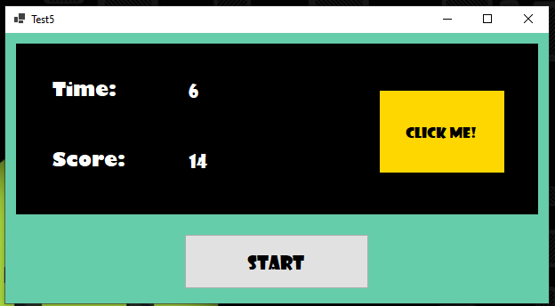

# Test 5
### Tarea:
Crear una aplicación que contenga un botón que simula una operación de 10 segundos. Durante ese lapso la UI no se debe tildar permitiendo al usuario moverla.

### Resolucion:
A partir de la consigna desarrolle un minijuego el cual consiste en hacer la mayor cantidad de clicks antes que la tarea termine de ejecutarse. Por motivos meramente visuales agregue a la interfaz grafica un timer que muestra cuando tiempo resta.

